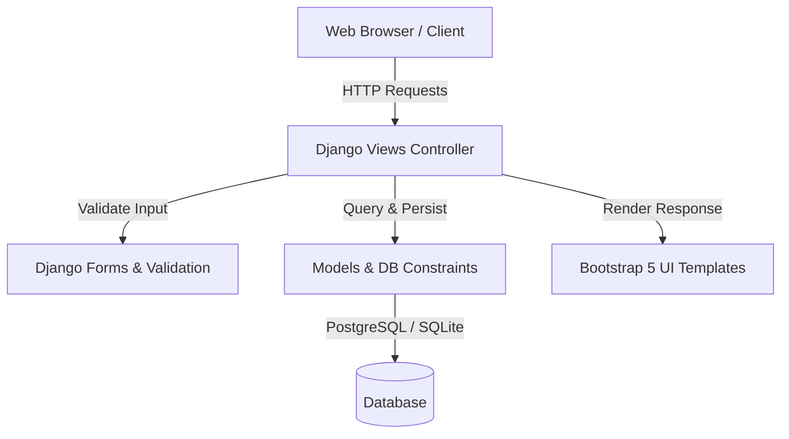
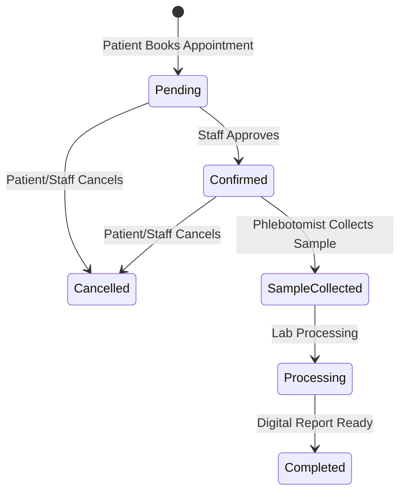

# Medical Lab Management System

[](https://github.com/urumb/med-lab/actions)
[](https://www.djangoproject.com/)
[](https://www.python.org/)
[](LICENSE)

A production-quality Django web application for managing medical laboratory diagnostic test bookings, patient accounts, test catalogs, and staff operations. Designed with modern healthcare UX principles, robust database constraints, and secure role-based authorization.

---

## 🚀 Live Demo & Demo Accounts

- **Live Deployed App**: [https://med-lab-mdps.onrender.com](https://med-lab-mdps.onrender.com)
- **Demo Staff Credentials**: Username `admin` | Password `admin123`
- **Demo Patient Credentials**: Username `john_doe` | Password `patient123`

---

## 📐 Architecture & Workflow Overview

### Application Architecture


### Booking Status Workflow


---

## ✨ Key Features

### 🩺 Patient Experience & Portal
- **Interactive Test Catalog**: Filter tests by specialized categories (Hematology, Biochemistry, Cardiology, etc.), search by test code or keyword, sort by price (asc/desc), and review preparation guidelines.
- **Online Appointment Booking**: Select preferred diagnostic tests, choose predefined 30-minute time slots within operational hours (8:00 AM - 8:00 PM), and receive instant confirmations with unique reference numbers (`LAB-YYYYMMDD-XXXX`).
- **Patient Dashboard**: Authenticated portal showing upcoming appointments, historical test records, status progression badges, and account profile controls.
- **Official Receipts**: Generate and print official itemized diagnostic receipts (`/booking/<ref>/receipt/`).
- **Self-Service Cancellation**: Cancel eligible pending or confirmed appointments.

### 🔬 Staff & Administrative Management
- **Laboratory Operations Dashboard**: Real-time staff dashboard displaying KPI stats (total patients, revenue, today's schedule, pending approvals).
- **Status Workflow Pipeline**: Manage sample collection lifecycle (`Pending` → `Confirmed` → `Sample Collected` → `Processing` → `Completed`).
- **Data Export**: Export filtered booking records to CSV for offline analysis (`/admin-dashboard/export-csv/`).
- **Django Admin Customization**: Enhanced Django admin interface with quick action shortcuts, prefetched relations, and date hierarchy breakdown.

---

## ⚙️ Tech Stack & Security

- **Backend**: Django 5.2.5 (Python 3.12)
- **Database**: PostgreSQL (Production) / SQLite3 (Local Development)
- **Static File Serving**: WhiteNoise
- **Frontend**: Responsive Bootstrap 5, Bootstrap Icons, HTML5, AJAX
- **Security**: Strict IDOR authorization checks, CSRF protection, secure cookie settings, database uniqueness constraints (`unique_active_booking_slot`).

---

## 🛠️ Local Setup & Seed Data

### 1. Clone & Environment Setup
```bash
git clone https://github.com/urumb/med-lab.git
cd med-lab

python -m venv venv
source venv/bin/activate  # On Windows: venv\Scripts\activate
pip install -r requirements.txt
cp .env.example .env
```

### 2. Apply Migrations & Seed Demo Data
```bash
python manage.py migrate
python manage.py seed_data
```

### 3. Run Server
```bash
python manage.py runserver
```

---

## 🧪 Testing & Verification

Run the automated test suite:
```bash
python manage.py test
```

Run Django security check:
```bash
python manage.py check --deploy
```

---

## 📄 License

Distributed under the [MIT License](LICENSE).
